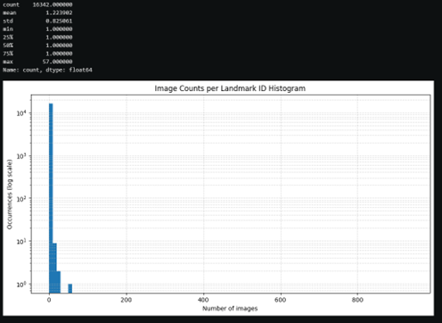
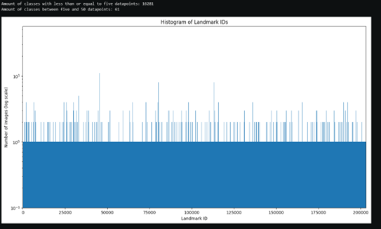
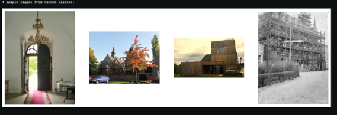
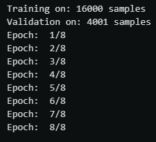
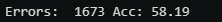

# landmark-classifier
## Google Landmarks Classification

This project aims to classify images using machine learning and deep learning models trained on the Google Landmarks Dataset. The dataset consists of images of various landmarks from around the world. It utilizes both traditional machine learning and deep learning techniques to classify these images accurately.

## Overview

The project is structured as follows:

1. **Data Exploration**: Initial exploration of the dataset to understand its structure and characteristics.
2. **Data Preprocessing**: Preprocess the images and labels to prepare them for training.
3. **Model Development**: Build and train machine learning and deep learning models for image classification.
4. **Evaluation**: Evaluate the trained models on validation data to assess their performance.
5. **Inference**: Test the trained models on unseen data and visualize the results.

## Dataset
[Google Landmarks Dataset V2](https://github.com/cvdfoundation/google-landmark)

## Dependencies

Ensure you have the following dependencies installed:

- numpy
- pandas
- keras
- cv2
- matplotlib
- scikit-learn
- tensorflow

## Usage

1. **Data Preparation**: Download the Google Landmarks Dataset and extract it. Make sure the dataset is structured appropriately, with images organized in folders and metadata available in a CSV file.

2. **Data Exploration**: Run the code to explore the dataset. This includes analyzing landmark distributions, image counts, and visualizing sample images.

3. **Model Training**: Train the classification model using the provided code. Adjust hyperparameters as needed.

4. **Evaluation**: Evaluate the trained model on validation data to assess its accuracy and performance.

5. **Inference**: Test the trained model on new images to classify them. Visualize the results and analyze the model's predictions.

## Code Structure

- `detect_landmarks.py`: Main script containing code for data preprocessing, model development, training, evaluation, and inference.

## Diagrams & Outputs
Displays the number of images that the model was able to sort and how often they occur
 

Displays the landmark IDs that appear between the range set in the program

Sample images pulled from the dataset

8 epochs were run on the dataset for training its accuracy
 
output of the accuracy and error rate of the model

